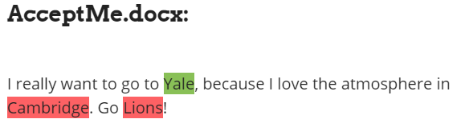

## [The App Checker App](https://appcheckerapp.artfuliq.com)
The App Checker App is a college essay checker that identifies instances where you reference the college you're applying to and instances where you reference other colleges to help you make sure that you are always talking about the correct college.

## What is the purpose?
College admissions have become increasingly competitive in the last few years and many equally qualified candidates are fighting for the same limited number of spots. As a result, admissions officers need a way to quickly weed out candidates who appear to be apathetic toward applying to the college, or are less dedicated and mindful. Mentioning the wrong college can seem like an indicator of both of those things and should be avoided at all costs.

## Document Creation
The App Checker App has the following information on thousands of colleges: official college name, shortened college names, college abbreviations, team name(s), website, and location. All of this data is combined in [collegeDataset.csv](https://github.com/egoldman15/The-App-Checker-App/blob/master/document-creation/collegeDataset.csv). The other documents in `document-creation` have individual information.

The csv files are not organized in columns because the program gets the college info from the full college name (the first item in every row). Some rows have more columns than others because some colleges have more nicknames, teams, etc. than others.

### Running Document Creation Files
All documents can be created at once using `bigDataset.py`. You should run that file in sections by commenting out parts.
Individual documents can be created with the other files. The csv files in `document-creation` have been manually corrected, but the files that will output from the python files will contain some errors.

Examples:
- Some locations gathered from `createTeamNameDataset.py` will be too specific (exact addreses) or too broad (multiple cities/counties). These instances are appended to `manualCheck.txt`.
- Output files may contain misplaced quotation marks that need to be fixed.
- Output files may contain blank items.
- College URLs may be in an incorrect format. This is important to fix because the best way to match college information is by its URL.

*Note: References to "mascots" in the documents should really be "team names".*

### Data sources
- [List of colleges](https://github.com/endSly/world-universities-csv)
- [College abbreviations](https://en.wikipedia.org/wiki/List_of_colloquial_names_for_universities_and_colleges_in_the_United_States)
- [Team names](https://en.wikipedia.org/wiki/List_of_college_team_nicknames_in_the_United_States)
- The Wikipedia articles were used as lists and most of the information came from each college's page.

## The Application
The App Checker App runs on a flask server. To run, install the modules in `requirements.txt` and follow the instructions for [installing Redislite](https://github.com/yahoo/redislite#requirements). The application in the repo is the same as the one running on the full site, but without the styling.

## Repos Used
 - [typeahead.js](https://github.com/twitter/typeahead.js/)
 - [Flask-Dropzone](https://github.com/greyli/flask-dropzone)
 - [Redislite](https://github.com/yahoo/redislite)

